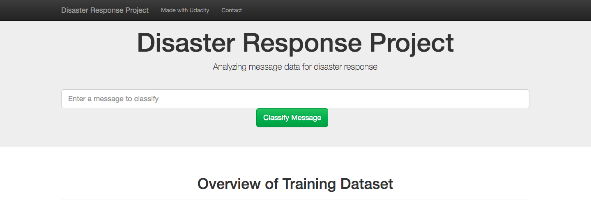

# Disaster Response Pipeline Project
## Project Description
Analyzed data set containing real messages that were sent during the disaster events from [Appen](https://appen.com/) (formally Figure 8). Created a machine learning pipeline to categorize these events.
The project includes a web app where an emergency message can be inputted and shows the classification results in several categories. The web ppp also display visualizations of the data.

## Installation
You can create a virtual environment by running `python -m virtualenv venv` and then activate.
You can install the necessary packages by running `pip install -r requirements.txt`

## Instructions
1. Run the following commands in the project's root directory to set up your database and model.

    - To run ETL pipeline that cleans data and stores in database
        `python data/process_data.py data/disaster_messages.csv data/disaster_categories.csv data/DisasterResponse.db`
    - To run ML pipeline that trains classifier and saves
        `python models/train_classifier.py data/DisasterResponse.db models/classifier.pkl`

2. Run the following command in the app's directory to run your web app.
    `python run.py`

3. Go to http://0.0.0.0:3000/
